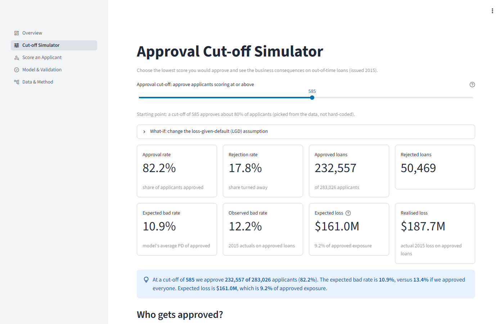
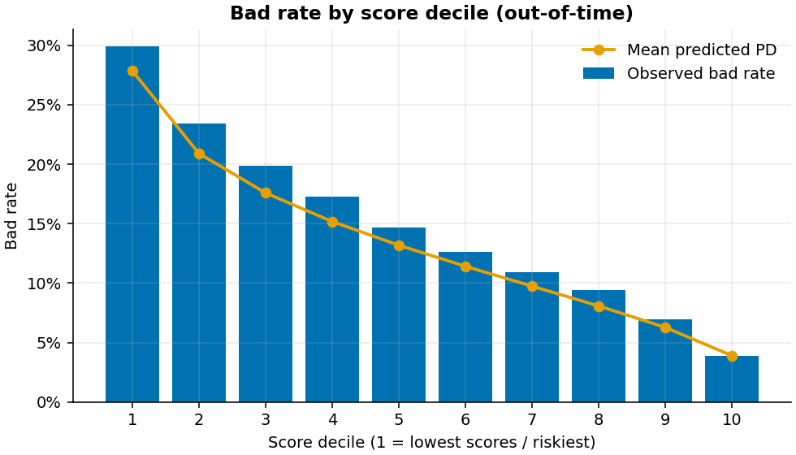
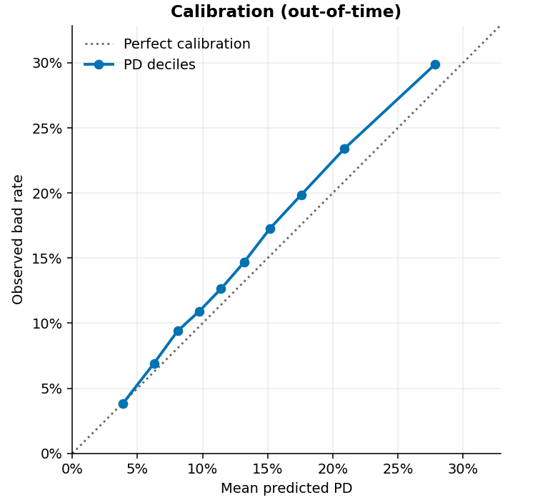
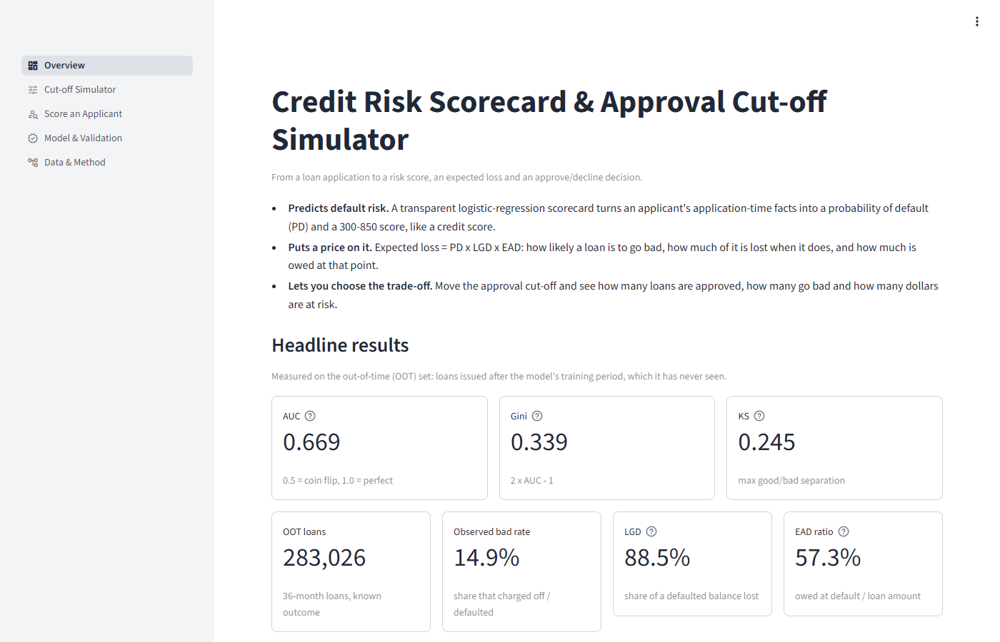
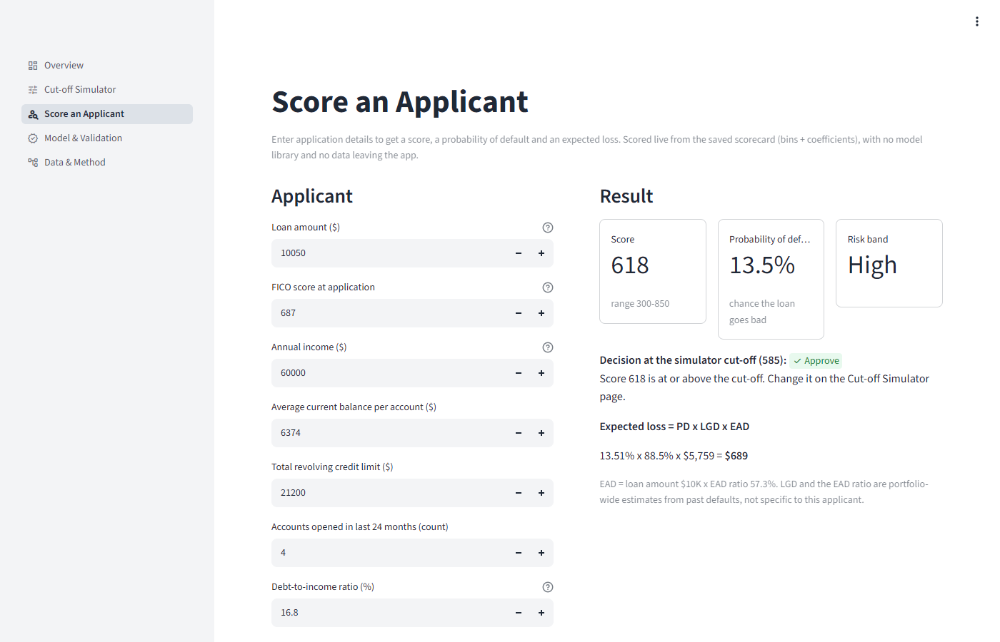
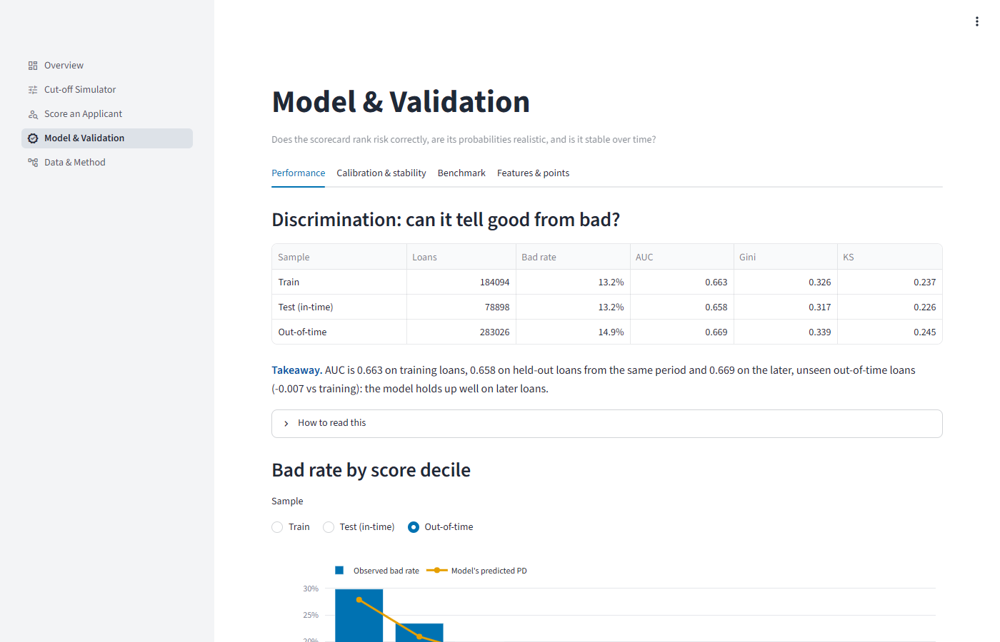
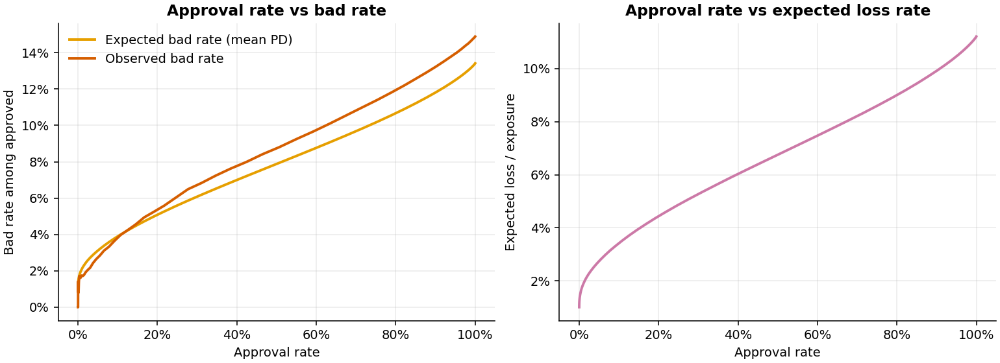

# Credit Risk Scorecard & Approval Cut-off Simulator

**Live demo:** https://credit-risk-scorecard-aakash.streamlit.app

An interpretable credit-risk scorecard built on ~2.26 million historical **Lending Club** loans.
It estimates each applicant's **probability of default (PD)**, converts it to a **300–850 credit
score**, prices the risk as **Expected Loss = PD × LGD × EAD**, and lets a user move the
**approval cut-off** to see the trade-off between approval volume, bad rate and dollars lost.

> Portfolio / educational project on public historical data. It is **not** a production lending
> decision system and must not be used to make credit decisions.



## Overview

| | |
|---|---|
| Data | Lending Club accepted loans 2007–2018 (2,260,668 valid rows, 151 columns) |
| Modelling sample | 546,018 mature 36-month loans issued 2013–2015 with a known outcome |
| Model | Logistic regression on 15 Weight-of-Evidence (WOE) features |
| Out-of-time result | AUC **0.669**, Gini **0.339**, KS **0.245** on 283,026 loans from 2015 |
| Output | PD, 300–850 score, risk band, expected loss, approve/decline at a chosen cut-off |
| App | 5-page Streamlit dashboard (overview, simulator, applicant scoring, validation, method) |

## Business problem

A lender has to decide **where to draw the line**. Approve too many applicants and defaults eat
the margin; approve too few and good customers go elsewhere. The question this project answers:

> *"If we approve everyone scoring at or above X, how many loans do we book, what bad rate should
> we expect, and how many dollars do we expect to lose?"*

## Dataset

- **Source:** Lending Club accepted loans 2007–2018Q4, the same file as Kaggle
  `wordsforthewise/lending-club`, fetched from a public CC0 mirror on Hugging Face and verified
  by SHA-256 ([docs/data_source.md](docs/data_source.md)).
- **Raw data is not in this repo.** `scripts/fetch_data.py` streams the 1.68 GB CSV and keeps a
  160 MB parquet extract locally. The raw file is never modified.
- **Data quality checks (run on the real file):** 0 duplicate ids, 0 duplicate rows, 33 junk
  footer rows removed, issue dates Jun-2007 to Dec-2018, data snapshot ~Mar-2019. Full profile:
  [`artifacts/data_profile/`](artifacts/data_profile/).

## Methodology

```
Raw data → Cleaning → Mature-loan filtering → Leakage removal → Feature engineering
→ WOE / IV → Logistic regression → PD → Credit score → Validation → Expected loss → Cut-off analysis
```

1. **Cleaning.** Drop footer rows, parse dates and percentage strings, pool rare categories.
2. **Mature-loan filtering.** Keep 36-month loans issued 2013–2015. By the 2018 snapshot they have
   all reached their end date, so 99.97% have a final outcome (147 still-open loans excluded).
   2012 was dropped because ~52% of its credit-bureau fields are missing (a data-collection gap).
3. **Target.** `bad = 1` for Charged Off / Default, `bad = 0` for Fully Paid.
4. **Leakage removal.** Only an explicit whitelist of application-time fields can become a feature.
   Post-origination fields are blocked, and a unit test enforces it. Measured on the real data,
   these fields would leak the answer: `last_fico_range` alone reaches AUC 0.92, `recoveries` 0.88,
   and every loan with `debt_settlement_flag = Y` defaulted
   ([leakage scan](artifacts/data_profile/leakage_univariate_auc.csv)). Lending Club's own
   `grade` / `int_rate` are excluded too (they are *its* risk model), as are `zip_code` and
   `addr_state` (fair-lending hygiene).
5. **Feature engineering.** FICO mid-point, credit-history length, loan-to-income,
   revolving-balance-to-income, employment length in years. "Months since last delinquency"-type
   fields keep *missing* as its own bin, because blank means "never happened".
6. **WOE / IV.** Each feature is binned (≤ 6 bins, monotonic bad rate). Each bin gets
   `WOE = ln(%good / %bad)`, and features are ranked by Information Value. Kept: IV ≥ 0.02,
   no pair correlated above 0.7, max 15 features.
7. **Logistic regression** on the WOE values. Every coefficient must have the expected (negative)
   sign, so each feature pushes risk in a direction a credit analyst would agree with.
8. **PD → credit score.** `score = 483.9 + 72.13 × ln(odds of repaying)`: 650 points = 10:1
   odds, and every **+50 points doubles the odds** of repaying. The score is also published as a
   points-per-attribute scorecard ([artifacts/scorecard_points.csv](artifacts/scorecard_points.csv)).
9. **Validation** on train, in-time test and a later **out-of-time** year (below).
10. **Expected loss** and the **cut-off simulator** (below).

## Architecture

```
scripts/fetch_data.py ──► data/raw/*.parquet (local only, gitignored)
                                   │
scripts/run_pipeline.py ──► src/scorecard/ (data → features → woe → model → scoring
                                   │         → validation → loss → cutoff → plots → sql)
                                   ▼
                   artifacts/ (~7 MB: model.json, woe_bins.json, metrics, cut-off table,
                               scored 2015 sample, SQL results, Power BI CSVs)
                                   │
app/streamlit_app.py ──────────────┘  reads artifacts only; scores applicants with numpy
                                      (no scikit-learn, no database, no secrets at runtime)
```

Training happens offline. The deployed app only reads small committed artifacts, so it starts in
seconds on Streamlit Community Cloud and needs no database, API keys or environment variables.

## Features used by the model

15 features, ranked by Information Value: FICO score (0.135), annual income (0.090), average
current balance (0.071), total revolving limit, accounts opened in 24 months, debt-to-income,
accounts opened in 12 months, mortgage accounts, loan-to-income, home ownership, % of bankcards
over 75% utilised, months since most recent account, months since most recent inquiry,
credit-history length, active revolving accounts. Full table:
[artifacts/iv_table.csv](artifacts/iv_table.csv).

## Model & validation

All numbers below are produced by `python scripts/run_pipeline.py`
([artifacts/metrics.json](artifacts/metrics.json)).

| Sample | Loans | Bad rate | AUC | Gini | KS |
|---|---:|---:|---:|---:|---:|
| Train (2013–14, 70%) | 184,094 | 13.2% | 0.663 | 0.326 | 0.237 |
| Test (2013–14, 30%) | 78,898 | 13.2% | 0.658 | 0.317 | 0.226 |
| **Out-of-time (2015)** | **283,026** | **14.9%** | **0.669** | **0.339** | **0.245** |

How to read it:
- **Ranks risk well and holds up over time.** AUC on the unseen 2015 loans is no worse than on
  training, and the score distribution barely moved (**PSI 0.002**, well below the 0.1
  "investigate" threshold).
- **Clear separation.** The riskiest 10% of 2015 loans defaulted **29.9%** of the time vs **3.9%**
  for the safest 10%, and the lowest-scoring 30% contain **49%** of all defaults.
- **Honest benchmark.** Lending Club's own sub-grade reaches AUC **0.679** on the same loans. It
  uses information this scorecard deliberately excludes (its interest-rate pricing), so the
  scorecard trails it slightly with only application-time data.
- **Calibration drift.** The model under-predicts 2015 defaults (mean PD 13.4% vs 14.9% actual),
  because 2015 loans performed worse than 2013–14. A production model would be recalibrated.

| | |
|---|---|
|  |  |

## Expected loss

**EL = PD × LGD × EAD**

| Term | Meaning | How it is set |
|---|---|---|
| **PD** | Probability the loan defaults | From the scorecard, per applicant |
| **LGD** | Share of the exposure lost after recoveries | **88.5%**: pooled over the 24,285 training-period defaults: 1 − net recoveries / balance at default |
| **EAD** | Amount owed at default | **loan amount × 57.3%**: on average borrowers had repaid ~43% of principal before defaulting |

Assumptions and limits: LGD and the EAD ratio are single portfolio-wide averages (no per-loan
LGD model, no economic scenarios). Post-origination fields (`recoveries`,
`total_rec_prncp`, `collection_recovery_fee`) are used **only** to estimate these two
parameters from past defaults, never as model inputs.

**Back-test:** predicted EL was 98.7% of the actual loss on training loans, but 85.0% on 2015
loans, which reflects the same 2015 deterioration noted above.

## Approval cut-off simulator

Every applicant with a score at or above the cut-off is approved. Raising the cut-off approves
fewer loans, lowers the bad rate and lowers expected loss. The simulator shows the price of that
safety in lost volume. Results on the 283,026 loans issued in 2015:

| Cut-off | Approval rate | Approved | Rejected | Expected bad rate | Actual bad rate | Expected loss (% of exposure) | Actual loss |
|---:|---:|---:|---:|---:|---:|---:|---:|
| none | 100.0% | 283,026 | 0 | 13.4% | 14.9% | $232.8M (11.2%) | $274.0M |
| 550 | 96.6% | 273,411 | 9,615 | 12.7% | 14.2% | $214.9M (10.7%) | $253.1M |
| **585** | **82.2%** | **232,557** | **50,469** | **10.9%** | **12.2%** | **$161.0M (9.2%)** | **$187.7M** |
| 600 | 71.6% | 202,598 | 80,428 | 9.8% | 11.0% | $129.7M (8.3%) | $150.1M |
| 620 | 54.9% | 155,424 | 127,602 | 8.3% | 9.2% | $88.1M (7.1%) | $100.4M |
| 650 | 31.1% | 87,893 | 195,133 | 6.2% | 6.8% | $40.1M (5.4%) | $44.8M |

Example: a cut-off of **585** turns away 18% of applicants and cuts expected loss by **$71.8M
(31%)** compared with approving everyone. The app opens at this cut-off, the highest one that
still approves about 80% of applicants. Risk bands in the app: Very Low (700+), Low (650–699),
Medium (600–649, about average risk), High (550–599), Very High (<550).

## Screenshots

| Overview | Score an applicant |
|---|---|
|  |  |
| **Model & validation** | **Cut-off trade-off** |
|  |  |

## Skills demonstrated

| Skill | Where |
|---|---|
| Python, data cleaning | `src/scorecard/data.py`, `features.py`; `scripts/fetch_data.py` (streamed, hash-verified ingest) |
| SQL | `sql/*.sql` run with DuckDB: status mix, portfolio by year & grade, score-band summary |
| Statistics | WOE / IV, KS, Gini, PSI, calibration, decile analysis (`woe.py`, `validation.py`) |
| Logistic regression & credit-risk modelling | `model.py`, `scoring.py` (PDO scaling, points table), `loss.py` (PD × LGD × EAD) |
| Model validation | train / test / out-of-time, benchmark vs LC sub-grade, EL back-test |
| Business decision-making | cut-off simulator and table above (`cutoff.py`, `app/`) |
| Dashboarding | Streamlit app (live); Power BI-ready CSVs + DAX measures in [docs/powerbi_guide.md](docs/powerbi_guide.md) (guide only, no `.pbix` included) |
| Testing | 137 pytest tests (synthetic data), incl. leakage guard and app page tests |

## Tech stack

Python 3.12 · pandas · NumPy · scikit-learn · DuckDB (SQL) · Matplotlib · Plotly · Streamlit ·
pytest · Ruff · Streamlit Community Cloud (hosting)

## Project structure

```
credit-risk-scorecard/
├── app/                    Streamlit dashboard (streamlit_app.py + 5 pages in scorecard_ui/)
├── src/scorecard/          pipeline package: config, data, features, woe, model, scoring,
│                           validation, loss, cutoff, predict, plots, sql, pipeline
├── sql/                    DuckDB queries used for portfolio profiling
├── scripts/                fetch_data.py, run_pipeline.py, make_dev_artifacts.py
├── artifacts/              small model outputs the app reads (+ data_profile/, powerbi/)
├── reports/figures/        charts generated by the pipeline
├── tests/                  pytest suite (synthetic data; no real data needed)
├── docs/                   methodology, decision log, data dictionary, data source, Power BI guide
├── data/                   raw / interim / processed (gitignored)
├── requirements.txt        app runtime dependencies (used by Streamlit Cloud)
└── pyproject.toml          package + dev dependencies
```

## How to run locally

```bash
git clone https://github.com/aakashc23/credit-risk-scorecard.git
cd credit-risk-scorecard
pip install -e ".[dev]"

# Dashboard only (uses the committed artifacts, no data download needed)
streamlit run app/streamlit_app.py

# Full rebuild from raw data (~12 min download, ~30 s pipeline)
python scripts/fetch_data.py
python scripts/run_pipeline.py

# Tests
pytest
```

No environment variables or secrets are needed (see [.env.example](.env.example)).

### Deployment

Hosted on Streamlit Community Cloud (free): repo `aakashc23/credit-risk-scorecard`, branch
`main`, main file `app/streamlit_app.py`, Python 3.12. Dependencies come from
`requirements.txt`. Every push to `main` redeploys automatically. To retrain, run the pipeline
locally and commit the updated `artifacts/`.

## Limitations

- **Accepted loans only.** There is no data on rejected applicants (no reject inference), so the
  simulator re-scores Lending Club's approved book. It cannot say how declined applicants would
  have performed.
- **Calibration drift.** PDs are calibrated to 2013–14 and under-predict 2015 losses by ~15%.
- **Simple loss model.** One pooled LGD and EAD ratio, no macro-economic scenarios.
- **Scope.** 36-month loans only, a single lender, 2013–2015 vintages.
- The model trails Lending Club's own grade (AUC 0.669 vs 0.679), which used extra information.
- Portfolio / educational project, not a production lending system.

## Future improvements

- Recalibrate PDs on recent vintages and monitor PSI over time.
- Add 60-month loans with a term-appropriate maturity window.
- Segment LGD (e.g. by loan purpose or grade) instead of one pooled value.

## Further reading

[Methodology](docs/methodology.md) · [Decision log](docs/decisions.md) ·
[Data dictionary](docs/data_dictionary.md) · [Data source](docs/data_source.md) ·
[Power BI guide](docs/powerbi_guide.md)
